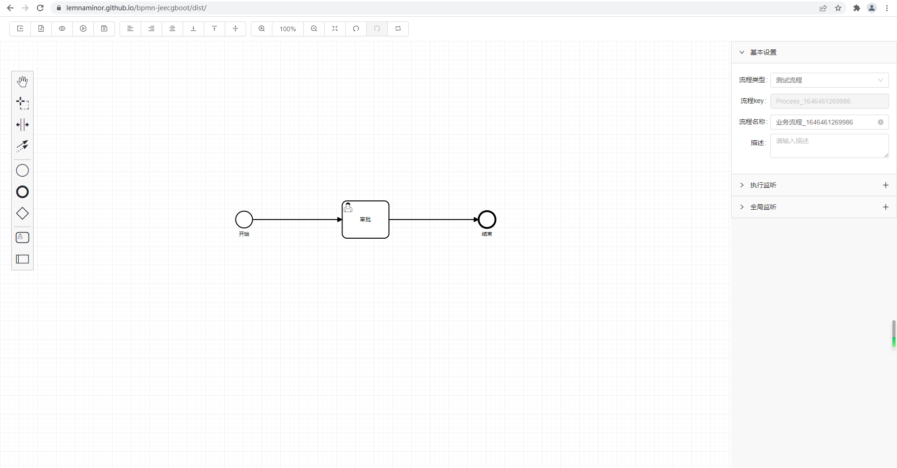

# bpmn-jeecgboot

发布日期：2022-03-06

[](https://github.com/Lemnaminor/bpmn-jeecgboot)
&emsp;[](https://gitee.com/liangheng1028/bpmn-jeecgboot)


#### 项目描述：
基于vue2.x、bpmn.js、antdv、bpmn-process-designer 仿jeecg-boot的工作流程图。

运行示例：[https://lemnaminor.github.io/bpmn-jeecgboot/dist](https://lemnaminor.github.io/bpmn-jeecgboot/dist "https://lemnaminor.github.io/bpmn-jeecgboot/dist")

示例图片：

#### 组件调用示例：
```js
import bpmnPage from '@/components/bpmnPackage/bpmnPage.vue'
```
```html
<bpmn-page :bpmnId="bpmnId" @eventClose="eventClose" />
```

#### 引入项目说明：

##### 项目文件夹：/src/components/bpmnPackage

##### package.json
```json
  "dependencies": {
    "bpmn-js-token-simulation": "^0.10.0",
    "highlight.js": "^10.5.0",
    "x2js": "^3.4.2"
  },
  "devDependencies": {
    "node-sass": "^4.12.0",
    "sass-loader": "^8.0.2",
    "bpmn-js": "^8.8.3",
    "ant-design-vue": "^1.7.2"
  },
```


##### npm安装
```js
npm install  @babel/plugin-proposal-optional-chaining // 可选链运算符 ?.
npm install  @babel/plugin-proposal-nullish-coalescing-operator // 空值合并运算符 ??
```

##### 配置babel.config.js
```js
module.exports = {
  plugins: [
    '@babel/plugin-proposal-optional-chaining',  // 可选链运算符 ?.
    '@babel/plugin-proposal-nullish-coalescing-operator'  // 空值合并运算符 ??
  ]
}
```

##### main.js
```js
// bpmnPackage组件引用
import Antd from 'ant-design-vue'
import bpmnPackage from "@/components/bpmnPackage/index.js";
import 'ant-design-vue/dist/antd.css';
import hljs from 'highlight.js'
import 'highlight.js/styles/atom-one-dark.css'  //这里有多个样式，自己可以根据需要切换

Vue.use(Antd);
Vue.use(bpmnPackage);
Vue.use(hljs.vuePlugin);

import "@/components/bpmnPackage/theme/index.scss";
import "bpmn-js/dist/assets/diagram-js.css";
import "bpmn-js/dist/assets/bpmn-font/css/bpmn.css";
import "bpmn-js/dist/assets/bpmn-font/css/bpmn-codes.css";
```

#### 项目运行：
1，项目下载依赖
```
npm install 或者 cnpm install
```
2，项目运行
```
npm run serve
```
3，项目打包
```
npm run build
```

#### 参考链接（感谢）：
bpmn-process-designer: [https://github.com/miyuesc/bpmn-process-designer](https://github.com/miyuesc/bpmn-process-designer "https://github.com/miyuesc/bpmn-process-designer")

bpmn.js: [https://github.com/bpmn-io/bpmn-js](https://github.com/bpmn-io/bpmn-js "https://github.com/bpmn-io/bpmn-js")

jeecg-boot: [http://www.jeecg.com](http://www.jeecg.com "http://www.jeecg.com")

ant-design-vue: [https://www.antdv.com/docs/vue/getting-started-cn](https://www.antdv.com/docs/vue/getting-started-cn "https://www.antdv.com/docs/vue/getting-started-cn")

### 其他说明：
1，如此项目对你有所帮助很开心，请点一下star以帮助到更多的人。

2，如项目有问题请提issue，或者联系我本人QQ：291294950。